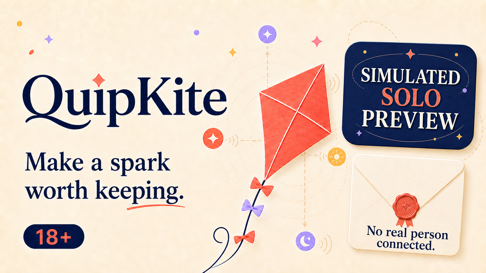

# QuipKite

**Make a spark worth keeping.**

QuipKite is an adults-only, short-form word game that turns small reactive choices into an unexpected shared-style story. The current public preview is intentionally simulated Solo play: no real person is connected.

[Play the simulated Solo preview](https://zappytap.itch.io/quipkite-simulated-solo-preview)

## What the preview demonstrates

- **A gentler opening:** Curated word choices replace the pressure of writing a perfect first message.
- **A clearer story view:** An illustrated setting, a focused current beat, collapsible history, and an anchored choice dock make the next decision easier to follow. Sending a word still requires explicit confirmation.
- **Choice-driven storytelling:** Each selection changes the next hand and the eventual landing, creating a compact story that can be saved as a postcard.
- **Shared moments without public chat:** Kite Knot reveals a Twin Spark or Crosswind Pair, Bridge Words bring earlier choices back into the story, and reversible depth settings let the tone deepen without locking the player in.
- **Private decisions stay separate:** Players can rate the experience privately and make an independent friendship choice without implying contact or relationship consent.
- **Progress worth returning to:** Completed flights award progress, private Landing Stamps, and keepsakes without paid boosts or streak-pressure mechanics.
- **Resilient local play:** Pause and resume, keyboard controls, recoverable saves, restricted-storage guidance, and responsive layouts keep the preview usable across common browser conditions.

## Product insight

Free-text chat creates both creative pressure and safety complexity. QuipKite tests a more structured interaction model: small choices create momentum, consent remains explicit, and the system—not another player—is responsible for keeping the round moving. That separation makes the experience easier to understand and keeps the boundaries of simulated play explicit.

## Verification snapshot

The current public preview is `0.30.0-storybook-rc1`. It adds an illustrated Museum scene, a more focused reading layout, postcard endings, and optional thematic sound and ambience with volume and mute controls. Separate Stories and Collection views, adjustable text, and optional Untimed Solo remain available.

A September 29, 2026 review verified all 59 recorded payload hashes in the browser package, which contains 60 regular files and one empty directory entry. Its SHA-256 is `640ADAC6E67C8A0DC463EA4FA619B28E112D14F80A0E915725840D2FDA9DC7F1`, published as itch.io upload `19466519`. All 60 hosted files were compared with the archive: 59 matched exactly, and the entry page retained the original HTML followed only by the inspected platform loader. This was an artifact and public-delivery review; it did not rerun the application's automated tests or certify physical devices, screen readers, or endpoint-security compatibility.

## Try a short story

Open the [public preview](https://zappytap.itch.io/quipkite-simulated-solo-preview), press **Run game**, and review the age and community prompts. Choose a story, select a word, then press **Send**. For example, try a different word when revisiting a fictional companion's prompt and compare how the conversation unfolds. Selecting a word alone does not submit it.

The cover above is promotional artwork, not a screenshot of the current interface. The public preview page includes interface images and current play instructions.

## Public preview boundary

This is a simulated Solo prototype, not a live social or dating service. It has no real-person matchmaking, public chat, production accounts, payments, or automatic product telemetry. Local preview state is not evidence of an online account or durable cloud record.

This repository is a public product and verification overview. Proprietary game source, production plans, moderation operations, internal evidence, credentials, and unpublished builds are intentionally excluded.

## Rights and disclosure

Game direction, review, and release ownership are first-party work by Gateway Information Group LLC. Generative tools assisted portions of the code, copy, and marketing artwork; the artwork was derived from creator-owned QuipKite material. See [LICENSE.md](LICENSE.md) and [PRIVACY.md](PRIVACY.md).

Copyright © 2026 Gateway Information Group LLC. All rights reserved.
